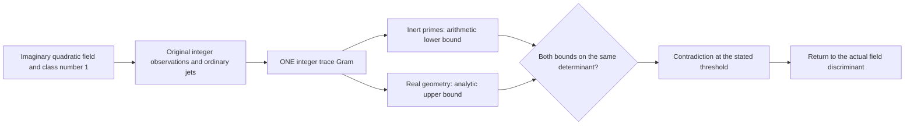

# The Tenth Discriminant

> **Current checked public endpoint — 4 November 2026.** The merged [Phase200 PR #126](https://github.com/Dojo-1/tenth-discriminant/pull/126) contains the actual-field, class-number-one theorem `|disc(K)| < 322^4 = 10,750,371,856`, relative to its encoded Lean definitions and standard axioms; independent human semantic review remains open in [#50](https://github.com/Dojo-1/tenth-discriminant/issues/50). [Phase209 draft #157](https://github.com/Dojo-1/tenth-discriminant/pull/157) explores an optimal ordinary-jet p-adic depth mechanism and a **conditional** `321^4` target; it is **not** a new field theorem. In Tao's Math 2.0 framing, we also compare zero-exclusion methods and what humans can reconstruct: [scope #158](https://github.com/Dojo-1/tenth-discriminant/issues/158). The 328^4 and 327^4 status prose retained below is a **dated historical snapshot**, not the current endpoint.

*Arithmetic against geometry, with one integer determinant in the middle.*

Can arithmetic force an integer to be **larger** than geometry allows it to be?

That is the guiding question of this AI-assisted investigation, begun in response to [Terence Tao's experimental tenth-discriminant challenge](https://terrytao.wordpress.com/2026/10/20/an-experimental-ai-math-challenge-using-tenth-discriminant-bounds-to-explore-arguments-ruling-out-siegel-zeroes/). The difficult part is not making a number smaller. It is showing that the arithmetic lower bound and geometric upper bound genuinely constrain **the same integer**, with the same polynomial jets, integral lattice, sampling set and field assumptions.

The repository combines number theory, exact computation, integral linear algebra, real geometry and Lean 4. It also records failed approaches. A failed transport, a lost prime factor or an incorrect normalization is useful evidence—not something to hide behind a more impressive-looking theorem.

## Where the formal work stands

**Current mainline Lean theorem — 3 November 2026.** For every totally complex quadratic number field $K$ of class number one, the encoded and checked theorem concludes that the **actual absolute field discriminant**, not an auxiliary Gram determinant, satisfies

```math
|\mathrm{disc}(K)|<328^4=11{,}574{,}317{,}056.
```

The declaration is [Threshold328.totallyComplex_degree_two_classNumber_one_discriminant_bound_328](lean/TenthDiscriminant/ActualField328.lean), integrated in [PR #116](https://github.com/Dojo-1/tenth-discriminant/pull/116) at [commit 1d74a750](https://github.com/Dojo-1/tenth-discriminant/commit/1d74a7506506feb350ac771329f372e2f4b089bd). All **33** exact-head PR checks passed, including whole-root Lean compilation, source correspondence, permitted-axiom and known-false controls, and CodeQL. The preceding $331^4$ theorem remains a fully checked historical predecessor.

**Next hypothesis, not yet a new field theorem.** [Phase196 / Issue #117](https://github.com/Dojo-1/tenth-discriminant/issues/117) investigates fourth root $327$ by tightening the *existing* radius logarithm and reusing the **original primes 3 and 5** via Phase192's exact floor-ratio gain. The rational preflight produces a positive *conditional* scalar margin, but the 327 geometry, upper, lower and field chain must pass their own Lean and source checks before any claim of a new bound. See the [source-preserving research branch](https://github.com/Dojo-1/tenth-discriminant/tree/research/phase196-sharp-log327) and its [human explanation](https://github.com/Dojo-1/tenth-discriminant/blob/research/phase196-sharp-log327/research/thin_integrated/PHASE196_327_CANDIDATE.md).

**The boundary matters.** Lean checks formal statements relative to definitions, imports and permitted axioms; it cannot substitute for an independent mathematician reconstructing the maximal-order-to-inertness bridge, integral ordinary jets, positivity, Hadamard upper, scalar gap, and field interpretation. That review is still explicitly open in [Issue #50](https://github.com/Dojo-1/tenth-discriminant/issues/50). No new nine-field classification, independent referee endorsement, or novelty priority is claimed.

Earlier checked endpoints—$331^4$, $375^4$, $377^4$, [41,006,250,000](research/thin_integrated/HUMAN_GUIDE_CURRENT.md), and [approximately 47 billion](research/tight_radial_v1/HUMAN_RECONSTRUCTION.md)—remain historical. Proposed five-billion and alternative-support arguments are **not** established field bounds.

## The one integer that matters

Take the original rectangular monomials $Z^rW^s$. Their ordinary $Z$-derivatives, **holding $W$ fixed**, are

```math
\partial_Z^j(Z^rW^s)=
\begin{cases}
(r)_{\underline{j}}\,Z^{r-j}W^s, & 0\le j\le r,\\
0, & j>r.
\end{cases}
```

Evaluating these jets at the original integer-pair observations $Q$ produces an integer matrix $E_Q$. The original trace pairing supplies the positive diagonal channel metric $B_Q$, with weights $2$ and $2D$ in the corresponding channels. Together they define

```math
G_Q=E_QB_QE_Q^{\mathsf T},
\qquad
\Delta_Q=\det G_Q>0.
```

The determinant $\Delta_Q$ is an **auxiliary integer**, *not* the number field's discriminant. It is the meeting place of two arguments:

- **Arithmetic:** guarded inert-prime and binary divisibility force $\Delta_Q$ to have sufficient prime factors.
- **Geometry:** the original ordinary-jet Hadamard bound constrains the size of that very same $\Delta_Q$.

Changing $Q$, the derivative convention, the lattice or the trace metric can change the problem. A prettier estimate for a *different* Gram is not a proof about the original one.


```mermaid
flowchart LR
    K["Imaginary quadratic field and class number 1"] --> Q["Original integer observations and ordinary jets"]
    Q --> G["ONE integer trace Gram"]
    G --> P["Inert primes: arithmetic lower bound"]
    G --> A["Real geometry: analytic upper bound"]
    P --> C{"Both bounds on the same determinant?"}
    A --> C
    C --> X["Contradiction at the stated threshold"]
    X --> F["Return to the actual field discriminant"]
```

## How the current 328⁴ argument closes

The original thin-ellipse ordinary-$Z$-jet trace Gram $G_D$ is positive by the Phase193 geometry and interpolation argument. Phase191 supplies the source-matched odd-prime lower with the Phase190 $0.0879$ recovery, plus the existing binary factor **once**. Phase194 supplies the matching original Gram upper. Phase195 joins them and returns through the existing maximal-order and field equivalence interfaces to the *actual field discriminant*. The padded ellipse is used as a **count majorant**, not as a replacement determinant.

For $D\ge328^4$, with $R=\lfloor D/4\rfloor$ and $S=\lfloor R/25\rfloor$, the two inequalities constrain the **same positive integer**:

```math
\frac{999997}{1000000}\log D-\frac{57321}{10000}+\frac14\log 2
\;\le\;\frac{\log\det G_D}{R^2S}
\;\le\;\frac45\log D-\frac{1849}{2000}.
```

The certified $\log D\ge23.172$ and $\log2\ge0.6931$ give the exact rational separator $1371/250000000=0.000005484>0$. Its small size is a reason for precise source and normalization audits, not a claim that the encoded inequality failed.

Source route: [328 geometry](lean/TenthDiscriminant/SourceGeometry328.lean) · [source positivity](lean/TenthDiscriminant/SourcePositivity328.lean) · [same-Gram lower](lean/TenthDiscriminant/SameGramLower328.lean) · [same-Gram upper](lean/TenthDiscriminant/ThinUpper328.lean) · [actual field return](lean/TenthDiscriminant/ActualField328.lean). [Independent reconstruction](https://github.com/Dojo-1/tenth-discriminant/issues/50) is separate.

## What the different investigations establish

| Thread | What survives scrutiny | Where to inspect |
| --- | --- | --- |
| **Arithmetic (Phases162–166)** | Lean-checked divisibility and logarithmic lemmas for the original ordinary-jet Gram, with one binary factor and an odd-only prime product. | [Binary divisor](lean/TenthDiscriminant/BinaryNullTraceGram.lean) · [binary normalization](research/thin_integrated/PHASE165_EXACT_BINARY_NORMALIZATION.md) · [same-Gram log guide](research/thin_integrated/PHASE166_SAME_GRAM_LOG.md) |
| **Actual field bound (Phases193–195)** | Encoded strict $328^4$ actual-field endpoint, whole-root Lean-checked and integrated; independent semantic review still open. $331^4$ is historical. | [328 source](lean/TenthDiscriminant/ActualField328.lean) · [PR #116](https://github.com/Dojo-1/tenth-discriminant/pull/116) |
| **Source-prime recovery (Phases190–192)** | The $0.0879$ original-prime gain is mainline. Phase192's stronger $0.0895$ exact-floor certificate is focused-Lean evidence; its 327 application remains hypothetical. | [Mainline gain](lean/TenthDiscriminant/RecoveryGainSharpRatio.lean) · [Phase192 source](https://github.com/Dojo-1/tenth-discriminant/blob/research/phase192-tight-floor-recovery/lean/TenthDiscriminant/RecoveryGainFloorRatio.lean) |
| **327 research target (Phase196)** | Conditional rational separator and new source-exact Lean theorem targets, not yet an accepted field bound. | [Issue #117](https://github.com/Dojo-1/tenth-discriminant/issues/117) · [research branch](https://github.com/Dojo-1/tenth-discriminant/tree/research/phase196-sharp-log327) |
| **Characteristic observations (Phase158)** | Exact finite rank, coefficient-obstruction and $2$-adic capacity experiments; no uniform new field cutoff. | [Dossier](research/reverse_determinant/PHASE158_CHARACTERISTIC_JETS.md) · [verifier](research/reverse_determinant/phase158_characteristic_jets.py) |
| **Support and arithmetic gluing (Phases142, 159–160)** | Exact finite examples separating full rank, integral image, Smith data and Gram volume. A smaller support need not yield a smaller determinant bound. | [Phase142](research/ellipsoid_trimming/PHASE142_LEVERAGE_AND_UNISOLVENCE.md) · [Phase159](research/reverse_determinant/PHASE159_OBSERVATION_CONTINUUM.md) · [Phase160](research/reverse_determinant/PHASE160_ARITHMETIC_NEURITES.md) |
| **Symmetry (Phase161)** | Source-preserving conjugation and related finite controls; removing a symmetric observation is not automatically safe. | [Human guide](research/reverse_determinant/PHASE161_SYMMETRY_GUIDE.md) · [Lean](lean/TenthDiscriminant/ObservationConjugation.lean) |
| **Normalized 2-adic filtration (Phase181; bounded pilot)** | After the existing Phase162 row factors are removed, exact Smith barcodes distinguish two D=163 supports having the same first mod-2 nullity. No production-uniform gain or new field cutoff is proved. | [Finite pilot and explanation](research/reverse_determinant/PHASE181_NORMALIZED_BINARY_FILTRATION.md) · [open target #99](https://github.com/Dojo-1/tenth-discriminant/issues/99) |
| **Transport coherence (Phase179)** | The formal determinant-one rational shear preserves volume but not the anchored integral lattice. | [merged PR #98](https://github.com/Dojo-1/tenth-discriminant/pull/98) · [Lean](lean/TenthDiscriminant/TransportCoherence.lean) |

One exact arithmetic example behind the current transport study is worth keeping in sight:

```math
H=\begin{pmatrix}1&\frac12\\0&1\end{pmatrix},
\qquad
G_0=\begin{pmatrix}4&0\\0&4\end{pmatrix},
\qquad
HG_0H^{\mathsf T}
=\begin{pmatrix}5&2\\2&4\end{pmatrix}.
```

The two integral Grams have equal determinant $16$, yet not the same integral congruence class. The obstruction is concentrated at the prime $2$ *relative to the fixed lattice reference*. Transport the reference lattice as well, and the semantic question changes. This counterexample is not a new discriminant bound and not a theorem of intrinsic computational hardness. The formalization is integrated in [PR #98](https://github.com/Dojo-1/tenth-discriminant/pull/98); [PR #104](https://github.com/Dojo-1/tenth-discriminant/pull/104) adds finite fixed-versus-moving extraction controls.

For the dated, detailed research record—including unsuccessful attempts—see [RESEARCH_NOW.md](RESEARCH_NOW.md), the [reverse-determinant research index](research/reverse_determinant/README.md), and the [prior-art ledger](PRIOR_ART.md). The [earlier long README is archived](research/archive/ROOT_README_BEFORE_PHASE158_2026-11-01.md).

## Reproduce, inspect, challenge

The repository pins **Lean 4.19.0** and **Mathlib `c44e0c8ee63ca166450922a373c7409c5d26b00b`**. To build and audit the formal library:

```sh
cd lean
lake exe cache get
python3 verify_sources.py
lake build
python3 audit.py
python3 negative_controls.py
```

For one bounded exact finite experiment, from the repository root:

```sh
python3 -m pip install sympy==1.14.0 mpmath
python3 research/reverse_determinant/phase158_characteristic_jets.py
python3 research/reverse_determinant/phase181_normalized_binary_filtration.py
python3 research/reverse_determinant/phase181_thin_support_pilot.py
```

For the documentation's math/Markdown sanity check:

```sh
python3 scripts/check_readme_math.py README.md
python3 scripts/check_human_math.py
```

A successful finite test is evidence about the tested instances. A successful Lean build is evidence about the *encoded theorem*. Neither is an independent external review of the whole intended argument. If you find a missing hypothesis, wrong field identification, false lemma, normalization mismatch or counterexample, please include the exact claim and a reproducible witness. [Issue #50](https://github.com/Dojo-1/tenth-discriminant/issues/50) and [the source-to-source transport review](https://github.com/Dojo-1/tenth-discriminant/issues/51) are natural starting points.

## Attribution and context

The challenge and its [adelic-determinant context](https://terrytao.wordpress.com/2026/10/19/a-sketch-of-the-proof-of-non-existence-of-siegel-zeroes/) are due to **Terence Tao**. The derivative-determinant approach is credited to **Ben Green**; **Roelof van Dijk** and **Kyle Pratt** contributed distinct related methods discussed in Tao's thread. Related arguments and formalizations by **twinheterodox, Peter Murphy, Antoine Olivier**, and others include stronger bounds. The citations neither imply collaboration nor endorsement; see [PRIOR_ART.md](PRIOR_ART.md) and [METHOD_COMPARISON_CURRENT.md](METHOD_COMPARISON_CURRENT.md).

The question behind our characteristic-support experiments was inspired by **Miguel N. Walsh's** work on the polynomial method, not presented as a theorem he proved about our construction. See [Walsh's ICM survey](https://www.mathunion.org/fileadmin/ICM/Proceedings/uploads/ICM-2018-vol2-ver1-eb.pdf), [the inverse sieve problem](https://doi.org/10.1215/00127094-1645788), and [the polynomial method over varieties](https://doi.org/10.1007/s00222-020-00975-6).

Research direction: **Jesús Vilela Jato (Dojo-1)**, with substantial AI assistance for exploration, code, Lean, explanatory writing and checking. The AI systems are not independent referees. Our aim is not to turn machine-generated polish into borrowed authority, but to leave every mathematical claim open to reconstruction and correction.

*Documentation convention:* use inline $x$-style math and fenced `math` blocks for displayed formulae. Do not place mathematical expressions inside code spans or split a single-dollar expression across multiple lines. The sanity checks catch common markup failures, **not** mathematical mistakes or every possible MathJax rendering defect.
